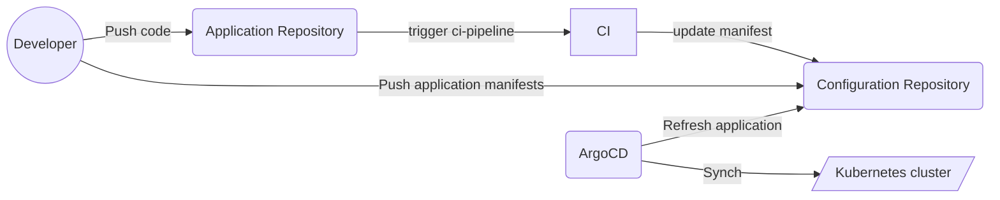
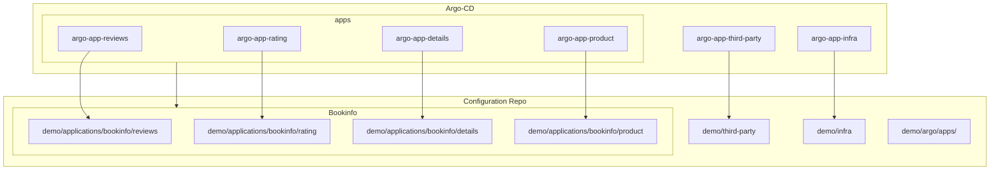

# Gitops Everythings with ArgoCD & Crossplane

###### tags: `Gitops` `ArgoCD` `Crossplane`

Manage continious delivery for applicatons, third party services and infrastructure with ArgoCD and Crossplane.


## :closed_book: Project structure

- `Main` directory : The directory that contains all our manifests used in the different steps. 
- `Demo` directory : This directory is used to simulate the configuration repository. The CI is simulated with shell scripts to update the `demo` directory that being synched. 

## :dart: Goal 

- CICD flowchart 



- ArgoCD applications and tracking manifests sources 




## :wrench: Setup


### Create a local Kind cluster

```bash
kind create cluster --name argocd-3-in-1
```
### Install ArgoCD

```bash
kubectl create namespace argocd
kubectl apply -n argocd -f https://raw.githubusercontent.com/argoproj/argo-cd/stable/manifests/install.yaml
```

- Port-forward Argo-CD user interface

```kubectl port-forward svc/argocd-server -n argocd 8080:443```

- Get admin secret 

```bash
kubectl -n argocd get secret argocd-initial-admin-secret -o jsonpath="{.data.password}" | base64 -d; echo
```

### Install crossplane

```bash
kubectl create namespace crossplane-system

helm repo add crossplane-stable https://charts.crossplane.io/stable
helm repo update

helm install crossplane --namespace crossplane-system crossplane-stable/crossplane
```

### Create GCP provider secret

In the folowing demo we will be using **GCP** to create our managed cloud services as part as the infrastructure of our configuration project. 

* Generate a `crossplane-gcp-provider-key` using `gcloud` cli. 
* Export credentials : `export BASE64ENCODED_GCP_PROVIDER_CREDS=$(base64 crossplane-gcp-provider-key.json | tr -d "\n")`

* Create a the gcp provider secret:

```bash
cat > provider-secret.yaml <<EOF
---
apiVersion: v1
kind: Secret
metadata:
  name: gcp-account-creds
  namespace: ${PROVIDER_SECRET_NAMESPACE}
type: Opaque
data:
  credentials: ${BASE64ENCODED_GCP_PROVIDER_CREDS}
EOF
```

```bash
kubectl apply -f "provider-secret.yaml"
```
* Activate billing on project

- For futher information : https://crossplane.io/docs/v1.8/cloud-providers/gcp/gcp-provider.html 

### Clean The demo directory 

Delete all files from `/demo` directory to start with a clean base.  

## Step 1 - Example application Nginx server

Let's start by installing a simple example application : 

- CI : add the application manifests to `demo` directory.  

```bash
bash main/ci/ci-example.sh`
````

- Create the argo application that will tracking `demo/applications/nginx`
```bash
kubectl apply -f demo/argo/nginx-app.yaml`
````

- Commit and push

- Check out the application

```bash
kubectl port-forward svc/nginx 8081:80 -n example`
```
  
- Change nginx version to `1.22.0` in demo application manifest. Commit and push and see how the argo application will sychronize the nginx application. 

## Step 2 - Applications Bookinfo project

Let's create now a more complex example. We deploy a `Bookinfo` application ( Istio exmple app ) that it's composed of 4 microservices.


- CI : add the application manifests to `demo` directory.  

```bash
bash main/ci/ci-bookinfo.sh`
````

- Create the argo application. The file `demo/argo/apps.yaml` is an app of apps that track the directory `/demo/argos/apps`. The latter contains an argo app for each microservice that tracks the microservice manifests. We need to create only the `apps` argo app so all apps will be applied automatically.  


```bash
kubectl apply -f demo/argo/apps.yaml`
````

- Commit and push

- Checkout the application

```bash
kubectl port-forward svc/productpage 9080:9080 -n bookinfo`
````

<http://localhost:9080/productpage>

- Delete deployment `review-v1` and see how argo will update the actual state. 

## Step 3 - Third party services

In this step we add a third party sofware in our cluster which is `Prometeheus`

- CI : add the application manifests to `demo` directory.  

```bash
bash main/ci/ci-third-party.sh`
````

- Create argo application for third party services
```bash
kubectl apply -f demo/argo/third-party.yaml`
````

- Commit and push

- Check out the argo interface

## Step 4 - Infrastructure

In this final step, let's assume that we have an SQL managed database is hosted in GCP cloud provider. 


- CI : Create the manifest of an SQLInstance database GCP resource
```
bash main/ci/ci-infra.sh
```

- Create argo application for the infrastructure : 
```bash
kubectl apply -f demo/argo/infra.yaml`
```

- Commit and push

- Go the your GCP console and notice that the database is being created. 

:warning: ***NB : Please remove the database manifest from `demo` directory in order to tell crossplane to delete the resource. Otherwise you risk to be billed if you have don't have a free tier plan.***

### Used tools

- Kind
- kubectl
- crossplane-cli
- gloud-cli
